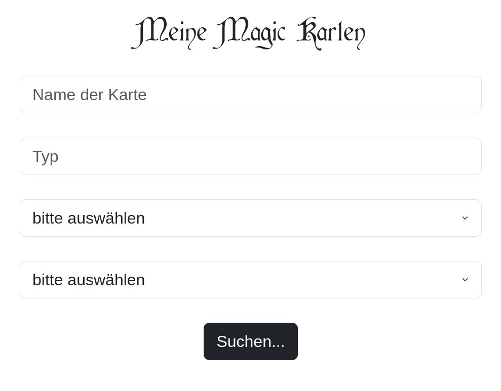

mtg_cards.py
============
It all started when I wanted to track my magic cards... I started out with a simple csv file in gnumeric. Then I thought, it would be cool to have a better interface to search them :) Then I used flask to read the csv file an show it in my browser (eg on localhost:5000). Now I am thinking of a mysqlq backend because it's much better for nested search queries and stuff like that, in my opinion. So this is where we're at now. A simple flas app that reads Magic Cards from a csv file.

usage
-----
To run the app for now you'd need a csv file like mine (gotta push an an example for easier usage). Then you'd need to set up a virtual environment like this:

`python -m venv mtg_card_venv`

Now you should have a directoy named mtg_card_venv with some python scripts in it. The next thing would be to source the activation file in the /bin dir like that:

`source mtg_card_venv/bin/activate`

After you did this you can go on and install flask:

`pip install flask`

Or even better (if I manage to push a requirements file) install all the dependencies from a requirements.txt file:

`pip install -r requirements.txt`

Now that everything is installed to your venv directory, you can start flask like this:

`flask --app mtg_cards run`

There are more ways to start a flask app but I thought this one is a very easy oneliner :)
Flask should start and open a port (like 5000) on your localhost ( http://localhost:5000 ). You can visit it with a browser.

And it should look somehow like this (without the font but you can get it here: https://www.dafont.com/cardinal.font )

todo
----
There are some things left to do:
* mysql backend
* deck builder
* crud methods (we only have r(ead) for now, c(reate),u(pdate) and d(elete) are missing)

license
-------
GPLv3 (see LICENSE file)

author
------
undermink <undermink@chaostal.de>
